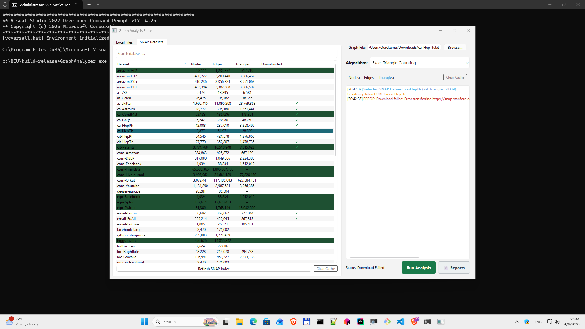

# GraphAnalyzer

A desktop application for analyzing large-scale graphs from the [Stanford SNAP](https://snap.stanford.edu/data/) dataset collection. Built for the Sublinear Algorithms Research Group at Bar-Ilan University, it provides efficient implementations of key graph-theoretic algorithms with a focus on performance and correctness on real-world network data.

---

## Screenshot

>

---

## What it does

GraphAnalyzer lets you browse, download, and analyze SNAP datasets directly from within the application. It focuses on graph properties that are relevant to sublinear algorithm research, network science, and theoretical computer science:

- **Triangle counting** — exact count using a generation-counter marked-array with sorted-intersection optimization, suitable for large sparse graphs
- **Degeneracy (k-core decomposition)** — O(V + E) computation of the degeneracy order and degeneracy value
- **Arboricity estimation** — parallel solver using per-vertex locking; arboricity α characterizes the density structure of a graph and bounds triangle density
- **SNAP dataset browser** — integrated browser with lazy URL resolution, live download prog            ress, and caching; supports the full SNAP catalog including social, road, web, and collaboration networks

---

## When to use it

GraphAnalyzer is aimed at researchers and practitioners who need to:

- Run graph analysis algorithms on real datasets without writing boilerplate I/O code
- Validate algorithm implementations against well-known SNAP benchmarks
- Explore structural properties (degeneracy, arboricity, triangle density) that appear in sublinear algorithm theory
- Prototype and compare algorithm variants in a controlled desktop environment

It is particularly suited to the kinds of graphs that appear in sublinear algorithm research: large, sparse, real-world networks where O(V + E) or better complexity matters.

---

## Algorithms

### Triangle counting

Counts all triangles in an undirected graph. The implementation:

- Orients edges from lower to higher degree (Chiba–Nishizeki orientation) to bound work per vertex
- Uses a generation-counter array for O(1) marking/unmarking without resets
- Applies sorted-list intersection on adjacency lists for cache-friendly inner loop
- Handles non-contiguous SNAP node IDs via remapping

Time complexity: O(m · α(G)) where α(G) is the arboricity.

### Degeneracy

Computes the degeneracy (maximum k such that a k-core exists) and produces a degeneracy ordering via iterative minimum-degree peeling.

Time complexity: O(V + E).

### Arboricity

Computes the arboricity α(G) — the minimum number of spanning forests needed to cover all edges — via the Nash-Williams formula applied to the degeneracy decomposition. The solver is parallelized with per-vertex try-lock mutexes for efficient multi-core utilization.

The arboricity is a key structural invariant: it bounds triangle count and characterizes graph density in ways that degree alone does not.

---

## Supported datasets

The SNAP browser connects to the Stanford SNAP repository and supports all datasets in the standard edge-list format (`.txt.gz`). Categories include:

| Category | Examples |
|---|---|
| Social networks | `com-youtube`, `com-lj`, `ego-Facebook` |
| Collaboration networks | `ca-AstroPh`, `ca-HepTh`, `ca-CondMat` |
| Road networks | `roadNet-CA`, `roadNet-TX` |
| Web graphs | `web-Google`, `web-NotreDame` |
| Citation networks | `cit-HepTh`, `cit-Patents` |
| Communication | `email-EuAll`, `email-Enron` |

Datasets are cached locally after the first download.

---

## Build

### Requirements

| Dependency | Version |
|---|---|
| Windows | 10 or 11 (x64) |
| MSVC | 2022 or later |
| Qt | 6.x (static) |
| CMake | 3.25+ |
| vcpkg | current |
| Ninja | current |

### vcpkg triplet

The build uses a fully static triplet to produce a standalone executable with no runtime DLL dependencies:

```
x64-windows-static-mt
```

### Build steps

```cmd
git clone <repo-url>
cd GraphAnalyzer

cmake -B build -G Ninja ^
  -DCMAKE_BUILD_TYPE=Release ^
  -DCMAKE_TOOLCHAIN_FILE=<vcpkg-root>/scripts/buildsystems/vcpkg.cmake ^
  -DVCPKG_TARGET_TRIPLET=x64-windows-static-mt

cmake --build build
```

The output is a single self-contained `.exe` in `build/`. No installer or Qt runtime installation required on the target machine.

---

## Project structure

```
GraphAnalyzer/
├── src/
│   ├── main.cpp
│   ├── mainwindow.cpp / .h       # Main UI, run orchestration
│   ├── snap_browser.cpp / .h     # SNAP catalog browser, download manager
│   ├── graph_loader.cpp / .h     # Edge-list parser, node ID remapping
│   ├── triangle_counter.cpp / .h # Triangle counting algorithm
│   ├── degeneracy.cpp / .h       # O(V+E) degeneracy / k-core peeling
│   ├── arboricity_solver.cpp / .h# Parallel arboricity computation
│   └── density_algorithm.cpp / .h
├── CMakeLists.txt
└── README.md
```

---

## Research context

This tool was developed to support research by the [Sublinear Algorithms Group](https://www.cs.biu.ac.il/) at Bar-Ilan University, with a focus on:

- Triangle counting with sublinear query complexity (Eden, Ron, Seshadhri)
- Arboricity-sensitive algorithms for dense subgraph detection
- Connections between structural graph parameters (α, degeneracy, triangle density) and efficient algorithm design

The implemented algorithms are designed to be correct reference implementations against which sublinear samplers and estimators can be validated.

---

## License

MIT License. See `LICENSE` for details.

---

## Acknowledgements

- [Stanford SNAP](https://snap.stanford.edu/) for the dataset infrastructure
- [Qt Project](https://www.qt.io/) for the application framework
- Sublinear Algorithms Research Group, Bar-Ilan University
